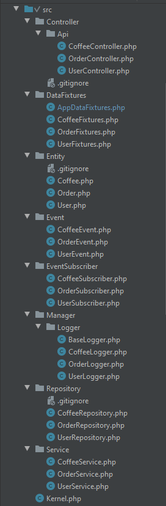

# Index
- [Task](#task)
- [Stack](#stack)
- [Install](#install)
- [Docker](#docker)
- [DataBase](#database)
- [Fixtures](#fixtures)
- [Endpoints](#api)     
- [PostMan](#postman)
- [Structure Directory](#structure-directory)
- [Routes](#routes)
- [Authentification / Authorization](#auth)    
- [UseCase](#use-case)
- [Logger](#logger)
- [Tests](#tests) : Unit / Itegration / Functional / UserCase
- [Quality Tools](#qa): Lint / CodeSniffer / CodeStandardFixer / MessDetector / Stan / Copy&PasteDetector
- [Coverage](#coverage)        
- [Composer](#composer)
- [About](#about)
- [MakeFile](#makefile)
        
---

## Task 
<a name="task"></a>
Create a API Test CRUD to manage a product stock.

#### Requeriments

    Docker container
    
    User roles:
        - Admin: all CRUD operations
        - Customer: view/buy coffee
    
    Entities:
        - User: id, username, password, role
        - Coffee: id, name, intensity, price, stock
        - Order: id, user_id, coffee_id, amount, quantity 
    
    Loggin, produce a logout with opeations.     

## Stack
<a name="stack"></a>
  
    Docker
        PHP 7.2
        Mysql 5.7
        Nginx
    
    Framework
        Symfony 4.3.4    
    
## Install
<a name="install"></a>
```bash
git clone https://github.com/jmaribau/DemoHtCm.git
cd DemoHtCm
docker-compose build
docker-compose up -d
docker-compose exec php-fpm composer install
docker-compose exec php-fpm chmod +x bin/console
docker-compose exec php-fpm php bin/console doctrine:schema:create
docker-compose exec php-fpm php bin/console doctrine:fixtures:load -n
```
Open browser and type: http://127.0.0.1:8050/api/coffees, you must be logged to show results.

#### Install trace
<a name="install-trace"></a>


### Execute commands
<a name="install-execute"></a>
Remember to execute Commands (MakeFile, Tests, Tools, Fixtures, etc...) inside bash of docker Image:
```bash
docker-compose exec php-fpm bash
```


## Components

    Entities
    Repositories
    Controllers
    Services
    Event
    EventSubscribers
    Managers
    Loggers
    Authentication  
    Authorization
    Roles
    Serializer
    DataFixtures
    QualityTools
    Profiler
    Debugger

## Docker
<a name="docker"></a>
`docker ps`


`docker-compose ps`


## DataBase
<a name="database"></a>

### Diagram
<a name="database-diagram"></a>


### Structure
<a name="database-structure"></a>

Raw file in `/docs/data/bd_structure.sql`  

 ```` bash
# Execute below commands inside bash
php bin/console doctrine:schema:create --dump-sql
 ````
 ````
CREATE TABLE coffee (
        id INT AUTO_INCREMENT NOT NULL, 
        name VARCHAR(255) NOT NULL, 
        intensity INT NOT NULL, 
        price INT NOT NULL, 
        stock INT NOT NULL, 
        PRIMARY KEY(id)
    ) DEFAULT CHARACTER SET utf8mb4 COLLATE utf8mb4_unicode_ci ENGINE = InnoDB;

CREATE TABLE shop_order (
        id INT AUTO_INCREMENT NOT NULL, 
        user_id INT NOT NULL, 
        coffee_id INT NOT NULL, 
        amount INT NOT NULL, 
        quantity INT NOT NULL, 
        INDEX IDX_323FC9CAA76ED395 (user_id), 
        INDEX IDX_323FC9CA78CD6D6E (coffee_id), 
        PRIMARY KEY(id)
    ) DEFAULT CHARACTER SET utf8mb4 COLLATE utf8mb4_unicode_ci ENGINE = InnoDB;

CREATE TABLE user (
        id INT AUTO_INCREMENT NOT NULL, 
        username VARCHAR(180) NOT NULL, 
        roles JSON NOT NULL, 
        password VARCHAR(255) NOT NULL, 
        UNIQUE INDEX UNIQ_8D93D649F85E0677 (username), 
        PRIMARY KEY(id)
    ) DEFAULT CHARACTER SET utf8mb4 COLLATE utf8mb4_unicode_ci ENGINE = InnoDB;

ALTER TABLE shop_order ADD CONSTRAINT FK_323FC9CAA76ED395 
    FOREIGN KEY (user_id) REFERENCES user (id);

ALTER TABLE shop_order ADD CONSTRAINT FK_323FC9CA78CD6D6E 
    FOREIGN KEY (coffee_id) REFERENCES coffee (id);
````

### Records
<a name="database-records"></a>
Raw File in `/docs/bd/bd_records.sql` 
````
INSERT INTO `coffee` (`id`, `name`, `intensity`, `price`, `stock`) VALUES
	(1, 'Cappuccino', 10, 5, 100),
	(2, 'Latte', 9, 6, 90),
	(3, 'Espresso', 8, 7, 80),
	(4, 'American', 7, 8, 70),
	(5, 'Macchiato', 6, 9, 60);

INSERT INTO `user` (`id`, `username`, `roles`, `password`) VALUES
	(1, 'admin', '["ROLE_ADMIN"]', '$argon2id$v=19$m=65536,t=4,p=1$29GWJ9sVPnx/jq2pdBlBPA$+mmjHOXLUMGa8SS3JxyCqQ/aRBGsE4bIFsQSPLH3Kpo'),
	(2, 'customer_1', '["ROLE_USER"]', '$argon2id$v=19$m=65536,t=4,p=1$pd7aeXYFv9tke0p21TSmyA$5iJ5sm5eLM4edHNawI3elgOyoLYkz10zgnJxsO0/+h4'),
	(3, 'customer_2', '["ROLE_USER"]', '$argon2id$v=19$m=65536,t=4,p=1$WuXm5XTc/dq/fJ2J0gtSIw$rGnjY846JL/WbLLBnV4UE1JA4u9ofQ1QdIAY5OGHKH8'),
	(4, 'customer_3', '["ROLE_USER"]', '$argon2id$v=19$m=65536,t=4,p=1$ZzzjiQftXLcp9iAD/eYBLA$X3gzf4evKPO7NGTI3moOTSNBhLkg5yzFJmWg0nynGOI'),
	(5, 'customer_4', '["ROLE_USER"]', '$argon2id$v=19$m=65536,t=4,p=1$vwQ8ZpBaxQr1XDw+ALqgAw$E0VpyP50B2vdynZUFRzEBoI30KivwowY/w4NKe4Momg');
	
INSERT INTO `shop_order` (`id`, `user_id`, `coffee_id`, `amount`, `quantity`) VALUES
	(1, 1, 1, 10, 2),
	(2, 2, 1, 20, 4),
	(3, 3, 2, 60, 10),
	(4, 4, 2, 30, 5),
	(5, 4, 3, 15, 2);

````

## Fixtures
<a name="fixtures"></a>
```bash
# Execute below commands inside bash
bin/console doctrine:schema:drop --force
bin/console doctrine:schema:update --force
bin/console doctrine:fixtures:load  -n
```


<a name="fixtures-make"></a>
or use make command:
```bash
# Execute below commands inside bash
make fixtures
```


### Data
<a name="fixtures-data"></a>
`/src/DataFixtures/AppFixtures.php`

- 5 users

Username | Password | Roles
--- |--- | --- |
admin      | pw_ad | ['ROLE_ADMIN']
customer_1 | pw_c1 | ['ROLE_USER']
customer_2 | pw_c2 | ['ROLE_USER']
customer_3 | pw_c3 | ['ROLE_USER']
customer_4 | pw_c4 | ['ROLE_USER']

- 5 coffees

Name | Intensity | Price | Stock
--- |--- | --- | --- |
Cappuccino | 10 | 5 | 100
Latte      | 9  | 6 | 90
Espresso   | 8  | 7 | 80
American   | 7  | 8 | 70
Macchiato  | 6  | 9 | 60

- 5 orders:

User | Coffee | Amount | Quantity
--- |--- | --- | --- |
admin | Cappuccino | 10 | 2
customer_1 | Cappuccino | 20 | 3
customer_2 | Latte | 60 | 10 
customer_3 | Latte | 30 | 5
customer_3 | Espresso | 15 | 2 
   
## EndPoints
<a name="api"></a>


## PostMan

You can import collection and environment to check endpoints in PostMan application.<br/><br/>
*Important:* Remember fist to loggin with ROLE_ADMIN or ROLE_USER before execute endPoints because Api have Json Web Token Autenthification. 
Use POST /api/login_check {{ROLE_ADMIN}} or POST /api/login_check {{ROLE_USE}}**<br/><br/>
*Important:* If you run all endpoints, remember to charge the fixtures before or endpoints fail.

**Import File for PostMan Environment** <br/>
`docs/PostMan/Api_HtCm.postman_collection.json`

**Import File for PostMan Collection**<br/>
`docs/PostMan/Technical_Test_HtCm.postman_environment.json`

### Authentication Json Web Token JWT ROLE_ADMIN


### Authentication Json Web Token JWT ROLE_USER


### Results By ROLE_ADMIN

### Results By ROLE_USER


## Structure Directory
<a name="structure-directory"></a>

/src | /test
:---:|:---:
 | 

## Routes
<a name="routes"></a>
```` 
# Execute below commands inside bash
bin/console debug:router --show-controllers
````


## Authentication / Authorization
<a name="auth"></a>


## Use Case
 1. admin create new coffee ('newcoffee',10,3,20)
 2. customer1 buy 3 units
 3. customer2 buy 10 units
 4. customer3 buy 10 units

You can see the executation in /tests/UserCase/UserCaseTest.php

 `/tests/UserCase/UserCaseTest.log`

 


## Logger
with Monolog

Log files in:<br/>
`/var/log/dev.app.log`<br/>
`/var/log/test.app.log` (it's new on every test)


 
 
 

## Tests
<a name="tests"></a>
In boostrap phpunit, I drop/create the database, create/update schema, and load fixtures on every execution of tests.

At the end of each test, the database is ROLLBACK, for the next test with the initial stat of database. 
````bash
# Execute below commands inside bash
php bin/phpunit
````


### Unit Tests
<a name="tests-unit"></a>
````bash
# Execute below commands inside bash
php bin/phpunit --testdox --group unit
````


### Integration Tests
<a name="tests-integration"></a>
````bash
# Execute below commands inside bash
php bin/phpunit --testdox --group integration
````


### Functional Tests
<a name="tests-functional"></a>
````bash
# Execute below commands inside bash
php bin/phpunit --testdox --group functional
````


### UseCase Tests
<a name="tests-usecase"></a>
````bash
# Execute below commands inside bash
php bin/phpunit --testdox --group usecase
````


## Quality Tools
<a name="qa"></a>
To ejecute all Quality Tools together: 
````bash
# Execute below commands inside bash
make qa
````


#### PHPLint
<a name="qa-phplint"></a>
````bash
# Execute below commands inside bash
./vendor/bin/phplint ./ --exclude=vendor --cache=phplint.cache
````


#### PhpCodeSniffer
<a name="qa-phpcs"></a>
````bash
# Execute below commands inside bash
./vendor/bin/phpcs --standard=PSR1,PSR2 src/ tests/ -v
````  


#### Php CS Fixer
<a name="qa-phpcsf"></a>
````bash
# Execute below commands inside bash
./vendor/bin/php-cs-fixer fix src/ --diff -v
````


#### PhpStan  
<a name="qa-phpstan"></a>
````bash
# Execute below commands inside bash
./vendor/bin/phpstan analyse src/ tests/ --level 6  
````


#### PHPMessDetector
<a name="qa-phpmd"></a>
````bash
# Execute below commands inside bash
./vendor/bin/phpmd src/ text phpmd.xml
./vendor/bin/phpmd tests/ text phpmd.xml
````  


#### PHPCopy&PasteDetector
<a name="qa-phcpd"></a>
````bash
# Execute below commands inside bash
./vendor/bin/phpcpd src/ tests/ --min-lines 5 --min-tokens 70
````  


## Coverage
<a name="covergae"></a>
http://127.0.0.1:8050/coverage/index.html
````bash
# Execute below commands inside bash
php bin/phpunit --coverage-text --coverage-html public/coverage
````  


## Composer
<a name="composer"></a>
````bash
# Execute below commands inside bash
$ composer show --self
````  


## About
<a name="about"></a>
````bash
# Execute below commands inside bash  
$ bin/console about
````  


## Makefile
<a name="makefile"></a>
````bash
# Execute below commands inside bash
$ make qa
$ make test
````

````
.PHONY: init fixtures codacy codecov
init: qa

fixtures:
	php bin/console doctrine:schema:drop --force
	php bin/console doctrine:schema:update --force
	php bin/console doctrine:fixtures:load -n

.PHONY: cc-dev cc-prod cc-test purge
cc: cc-dev cc-prod cc-test

cc-dev:
	php bin/console cache:clear --env=dev

cc-prod:
	php bin/console cache:clear --env=prod --no-debug

cc-test:
	php bin/console cache:clear --env=test

purge:
	rm -rf var/cache/* var/logs/*

.PHONY: test test-unit test-integration test-functional
test:
	php bin/phpunit

test-unit:
	php bin/phpunit --stop-on-failure --group unit

test-integration:
	php bin/phpunit --stop-on-failure --group integration

test-functional:
	php bin/phpunit --stop-on-failure --group functional

.PHONY: coverage coverage-unit coverage-integration coverage-functional
coverage:
	php bin/phpunit --coverage-text --coverage-html public/coverage --coverage-clover 'coverage.xml'

coverage-unit:
	php bin/phpunit --group unit --coverage-html public/coverage/unit

coverage-integration:
	php bin/phpunit --group integration --coverage-html public/coverage/integration

coverage-functional:
	php bin/phpunit --group functional --coverage-html public/coverage/functional

coverage-temp:
	php bin/phpunit tests/Integration/Service --coverage-html public/coverage

.PHONY: external codacy codecov
external: codacy codecov

codacy:
	php codacy-coverage.phar phpunit docs/coverage/clover

codecov:
	bash <(curl -s https://codecov.io/bash)

qa: qa-lint qa-phpcs qa-phpcsf qa-phpstan qa-phpmd qa-phpcpd

qa-lint:
	./vendor/bin/phplint src/ tests/

qa-phpcs:
	./vendor/bin/phpcs src/ tests/ -p --colors --cache --standard=PSR1,PSR2 --report-source --report-summary --report-code=reports/phpcs.txt --report-diff=reports/phpcs.diff.txt

qa-phpcbf:
	./vendor/bin/phpcbf src/ tests/ --standard=PSR1,PSR2

qa-phpcs-a:
	./vendor/bin/phpcs src/ tests/ -a --colors --cache --standard=PSR1,PSR2

qa-phpcsf:
	./vendor/bin/php-cs-fixer fix src/ -v --rules=@PSR1,@PSR2,@Symfony,@PhpCsFixer,@DoctrineAnnotation --allow-risky=yes --dry-run
	./vendor/bin/php-cs-fixer fix tests/ -v --rules=@PSR1,@PSR2,@Symfony,@PhpCsFixer,@DoctrineAnnotation --allow-risky=yes --dry-run

qa-phpcsf-force:
	./vendor/bin/php-cs-fixer fix src/ -v --rules=@PSR1,@PSR2,@Symfony,@PhpCsFixer,@DoctrineAnnotation --allow-risky=yes
	./vendor/bin/php-cs-fixer fix tests/ -v --rules=@PSR1,@PSR2,@Symfony,@PhpCsFixer,@DoctrineAnnotation --allow-risky=yes

qa-phpcsf-diff:
	./vendor/bin/php-cs-fixer fix src/ -v --diff --rules=@PSR1,@PSR2,@Symfony,@PhpCsFixer,@DoctrineAnnotation --allow-risky=yes --dry-run
	./vendor/bin/php-cs-fixer fix tests/ -v --diff --rules=@PSR1,@PSR2,@Symfony,@PhpCsFixer,@DoctrineAnnotation --allow-risky=yes --dry-run

qa-phpcsf-report:
	./vendor/bin/php-cs-fixer fix src/ --dry-run -v --diff --rules=@PSR1,@PSR2,@Symfony,@PhpCsFixer,@DoctrineAnnotation --allow-risky=yes > reports/phpcsf.src.txt
	./vendor/bin/php-cs-fixer fix tests/ --dry-run -v --diff --rules=@PSR1,@PSR2,@Symfony,@PhpCsFixer,@DoctrineAnnotation --alow-risky=yes > reports/phpcsf.tests.txt

qa-phpstan:
	./vendor/bin/phpstan analyse src/ tests/ --level 6

qa-phpmd:
	./vendor/bin/phpmd src/ text phpmd.xml
	./vendor/bin/phpmd tests/ text phpmd.xml

qa-phpcpd:
	./vendor/bin/phpcpd src/ tests/ --min-lines 5 --min-tokens 70

qa2:
	#./vendor/bin/php-cs-fixer fix src/ --verbose --diff
    #./vendor/bin/php-cs-fixer fix tests/ --verbose --diff
    #./vendor/bin/phpmd src/ text cleancode,codesize,controversial,design,naming,unusedcode
    #./vendor/bin/phpmd test/ text cleancode,codesize,controversial,design,naming,unusedcode

````


